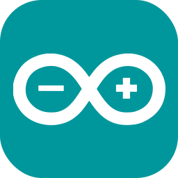
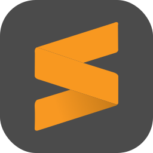
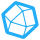

English version below

### Hallo ich bin Sebastian 👋

#### Über mich
Ich bin leidenschaftlicher Open Source Enthusiast und interessiere mich Systeme, Netzwerke und Programme 
sicher zu gestalten, sowie diese auf ihre Sicherheit zu prüfen. 
Mein Ziel ist es, mich immer weiter zu entwickeln und stets zu verbessern 🧠🏋️.

- 🔭 Zurzeit studiere ich Informatik an der Technischen Hochschle in Brandenburg.
- 🌱 Im Moment suche ich ständig technische Herausforderungen.
- 👯 Ich treffe mich mit Freunden im [Chaostreff Potsdam](https://www.ccc-p.org/) 🚀 und in der [Brandenburger Linux User Group](https://www.bralug.de/) 🐧.
- ⚡ Fun fact: Ich liebe schwimmen 🏊‍♂️.
- 📚 Mein Blog: [Hackwiki](https://www.hackwiki.de/)

#### 🔨 Erfahrungen:

  Klick👆

##### Progmmiersprachen:

	
	
	

###### Wenig Erfahrung mit:

	
	
	
	

##### Libraries und Frameworks:

	
	
	
	
	
	

##### Web:

	
	
	
	

##### Auszeichnungssprache:

	
	

##### Betriebssysteme:

	
	
	
	

##### Werkzeuge:
Eine kleine Liste von Werkzeugen die ich benutze, mal aufgesetzt oder zumindestens längerfristig benutzt habe.

##### Sicherheit:

	
	
	
	
	

##### Software Versionierung:

	</a> 
	
	
	

##### Texteditor:

	</a> 
	</a> 
	</a> 

##### Virtualisierung:

	</a> 
	</a> 
	</a> 

##### Konfigurationsmanagement:

	</a> 

##### Dokumentation:

	</a> 
	</a> 
	</a> 

##### Backup:

	</a>  
	
	

##### Arbeitsverwaltung/Projektmanagement:

	</a>  
	
	</a> 

##### Monitoring:

	</a> 
	</a> 
	</a> 
	</a> 
	</a> 
	</a> 

##### Andere:

	</a> 
		</a> 
	</a> 
	</a> 
	</a> 
	</a> 
	</a> 
	</a> 
	</a> 
	</a> 
	</a> 
	</a> 

#### 📈 Github Statistik 

  Klick👆

---

### Hello, I"m Sebastian 👋

#### About me
I'm a passionate open source enthusiast and am interested in making systems, networks and programs secure. 
And to check them for their security. My goal is to always develop and improve myself 🧠🏋️.

- 🔭 I'm currently studying Computer Science at the Technische Hochschle in Brandenburg.
- 🌱 At the moment I"m constantly looking for technical challenges.
- 👯 Meet with friends in the [Chaostreff Potsdam](https://www.ccc-p.org/) 🚀 and in the [Brandenburger Linux User Group](https://www.bralug.de/) 🐧.
- ⚡ Fun fact: I love swimming  🏊‍♂️.
- 📚 My Blog: [Hackwiki](https://www.hackwiki.de/)

#### 🔨 Practical knowledge

  Click👆

##### Programming languages:

	
	
	

###### Less experience with:

	
	
	
	

##### Libraries and frameworks:

	
	
	
	
	
	

##### Web:

	
	
	
	

##### Markup language:

	
	

##### Operating system:

	
	
	
	

##### Tools:
A small list of tools that I use, have setup, or at least have used for a long time.

##### Security:

	
	
	
	
	

##### Software versioning:

	</a> 
	
	
	

##### Text editor:

	</a> 
	</a> 
	</a> 

##### Virtualization:

	</a> 
	</a> 
	</a> 

##### Configuration Management:

	</a> 

##### Documentation:

	</a> 
	</a> 
	</a> 

##### Backup:

	</a>  
	
	

##### Work Management/Project Management:

	</a>  
	
	</a> 

##### Monitoring:

	</a> 
	</a> 
	</a> 
	</a> 
	</a> 
	</a> 

##### Other:

	</a> 
		</a> 
	</a> 
	</a> 
	</a> 
	</a> 
	</a> 
	</a> 
	</a> 
	</a> 
	</a> 
	</a> 

#### 📈 Github statistics 

  Click👆

